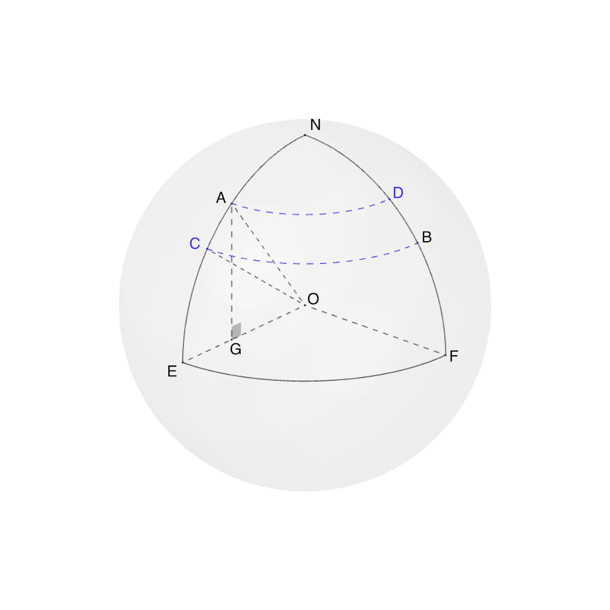

For ones who wonders that how the GPS system works. 

My ongoing project, smoke prediction, is need to count the number of firespot occured within the radius "x". 
Original data provide the latitude and longitude of the firespot detected by using a satellite. 
(for more ...)

Therefor, to count the number of firespot occured within "x" km from the interesting point. 
we need to find the distance between each firespot and our location. 

to find the distance between two point on Earth, we need to understand the basic trigonometry function which can study at ...

you can find serveral expositions of the "law of cosines" for spherical trigonometry 

The orthodromic distance is the shortest distance between two points on a sphere (Earth). To find the orthodromic distance, we need to know the co-ordinates of point A (lat1, lon1) and point B (lat2, lon2). 

....... 

Presuming a spherical Earth with radius R (figure 1), and that the locations of the two points, A and B, in spherical coordinates (longitude and latitude) are lon1, lat1 and lon2, lat2 respectively

Haversine formula 

Before we move to the derivation, we need to understand the meaning of "haversine". The "versine A" or (the versed sin(A)  is 1 - cos(A) 
The versine, also known as the "versed sine", is a little-used trigonometric function defined by 

$$
versin~\alpha = 2 sin^2 (\frac{1}{2}\alpha)={1 - cos~\alpha} 
$$

## Derivation of Haversine formula

$$ A(lat1, lon1), B(lat2, lon2) $$

Thus, $$ C(lat2, lon1), D(lat1, lon2) $$

Let's  $$ \angle AOC = \lvert lat1 - lat2 \lvert = \Delta lat $$ (delta of latitude)

we assume that we are given two point $$ P_{1} $$ and $$ P_{2} $$ determine by their respective lattitude-longitude pairs: $$ P_{1}(\theta_{1},\phi_{1}) $$ and $$ P_{2}(\theta_{2},\phi_{2}) $$

In cartesian coordinates we have $$ P_{1} = P_{1}(x_{1},y_{1},z_{1}) $$ and $$ P_{2} = P_{2}(x_{2},y_{2},z_{2}) $$, where $$x$$, $$y$$ and $$z$$ are determine by the sphereical coordinates through the following equations:

$$
x = R cos\theta cos\phi \\
y = R cos\theta sin\phi \\
z = R sin\theta
$$

therefore, the Euclidean distance $$ d $$ between $$ P_{1} $$ and $$ P_{2} $$ is: 

$$ 
d^2 = (x_{1} - x_{2})^2 + (y_{1} - y_{2})^2 + (z_{1} - z_{2})^2 
$$

Converting the cartesian coordinates to spherical coordinates, we get: 

$$
d^2 / R^2 = (cos\theta_{1} cos\phi_{1} - cos\theta_{2} cos\phi_{2})^2 + (cos\theta_{1} sin\phi_{1} - cos\theta_{2} sin\phi_{2})^2 + (sin\theta_{1} - sin\theta_{2})^2
$$

thus,
$$
d^2 / R^2 = 2 - 2 cos\theta_{1}cos\theta_{2}cos(\phi_{1}-\phi_{2}) - 2sin\theta_{1}sin\theta_{2}
$$

$$ 
sin(\frac{\alpha}{2}) = \frac{d}{2R} 
$$

$$
sin \alpha = 2sin(\frac{\alpha}{2})cos(\frac{\alpha}{2}) \\
            = \frac{d}{R} \cdot \sqrt{1-(\frac{d}{2R})^2} \\ 
            = \frac{d}{2R^2} \cdot \sqrt{4R^2 - d^2}
$$

$$
D = R\alpha = R \cdot arcsin(\frac{d}{2R^2} \cdot \sqrt{4R^2 - d^2}) 
$$

$$
haversin A = sin^2(\frac{A}{2}) = \frac{1-cos A}{2}
$$

From, 
$$ distance = R \cdot \alpha $$

Hence the distance between two point on the earth is $$ 6731 \cdot c $$ km   
where $$ \alpha $$ is $$ 2 \cdot arcsin (\sqrt{a}) $$
and a is $$ sin(\frac{ \Delta lat}{2})^2 + cos(lat1) \cdot cos(lat2) \cdot sin(\frac{ \Delta lon}{2})^2 $$

versine means "the reversed of sine". 

Therefore, half of versine or "haversine" 

$$
haversine = \frac{1-cos\alpha}{2}
$$

Python Code
`gist:cboonnag/ef2e3033cbb8937d42f83ce5f86deb9f#geographical_distance.py`

